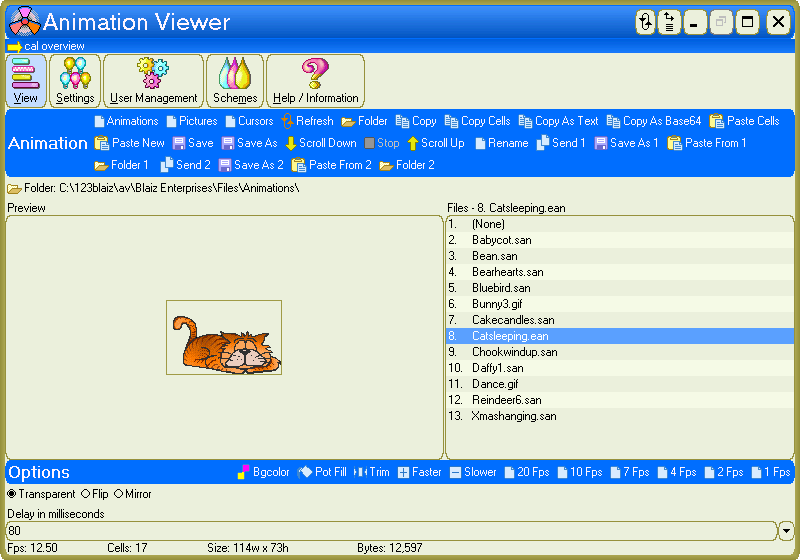
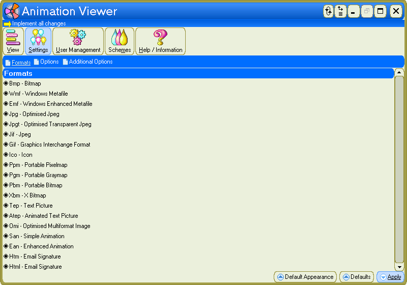
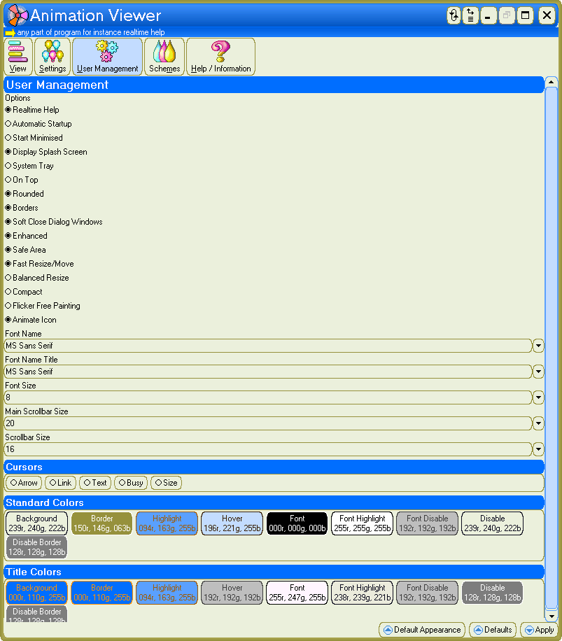
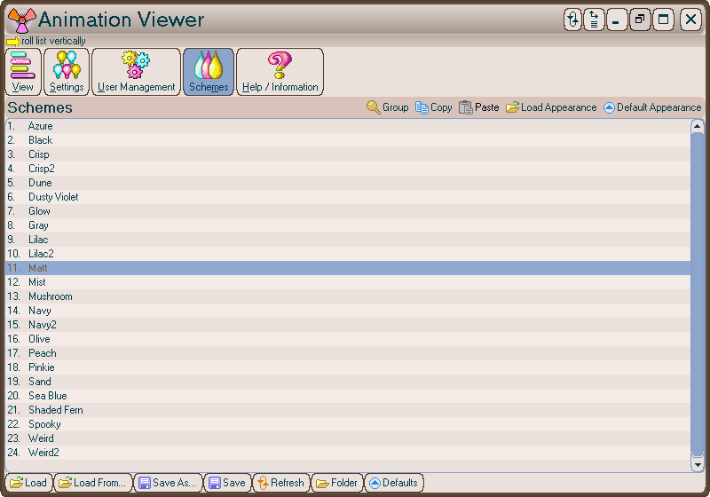
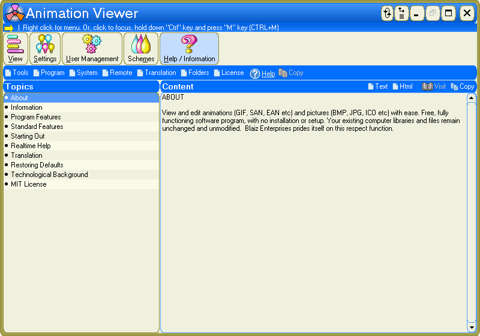

# AnimationViewer v1.0.3602 / 13nov2025 / MIT License
View and edit animations (GIF, SAN, EAN) and pictures (BMP, JPG, ICO) with ease.

# Features
* View animations in realtime
* Animation Preview frame
* Multiple graphic formats: BMP, WMF, EMF, JPG, JPGT, JIF, GIF - solid and transparent '89a', ICO - true color solid and transparent, PPM, PGM, PBM, XBM, TEP, ATEP, OMI, SAN, EAN, HTM / HTML - email signature
* Definable format listing
* Seamless format to format conversion
* Retain SaveAs format - for multiple same format saving
* Automatic scroll - definable speed, down / stop / up, continuous repeat
* Rename
* Transparent / Flip / Mirror
* Delay in milliseconds (animation speed)
* Pot Fill - create transparency, definable tolerance
* Trim - automatically delete unused areas on all cells
* Faster / slower speed options
* Custom preview background color
* Flash preview background color while scrolling
* Bgcolor - switch preview background colors
* Animation status bar readout: fps, cells, size width/height, bytes
* Single click for Animations / Pictures / Cursors Support Folder listing
* Edit SAN directly in Animator - from AV click "View" tab > "Edit"
* Copy Cells / Paste Cells - convert animation to / from "Image Strip" for external editing (e.g. MS Paint, graphics package)
* Copy As Text - copy animation to Clipboard as plain text. An example for use - a user defined graphic alongside "Custom Translation" panel under "Help / Information" (animated = ATEP or still = TEP automatically selected)
* 2x "Save As / Paste From" options - Save / Open from multiple Folders - e.g. use as work hub
* 2x "Send" options - copy animation to external Folders
* 2x "Send Replace Prompt" options
* 2x Definable "Send" Folders
* Sizeable
* Multilingual Interface
* Realtime Help - hover mouse over for instant, specific help
* Integrated Help
* Built-in help viewer with additional html / plain text external viewing options
* No installation
* Portable

# Download
Download <a href="src/av.exe">av.exe</a> or from the "<a href="bin/">bin</a>" or "<a href="src/">src</a>" folders above.

# Images

